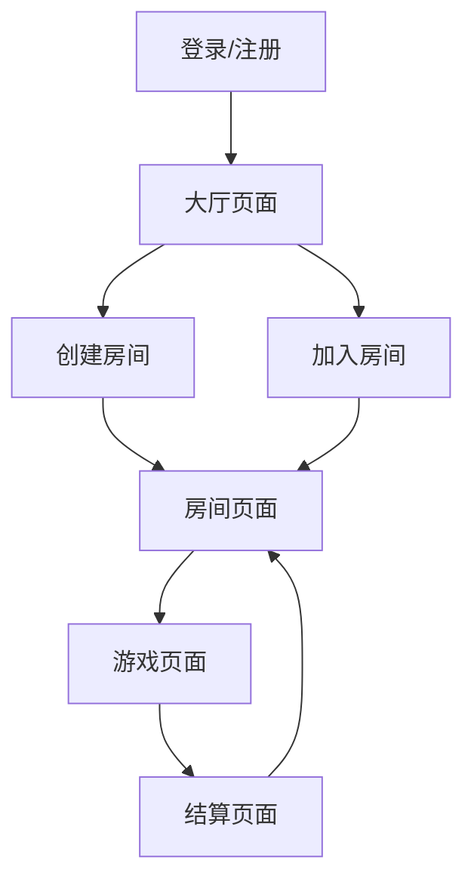

## 1. 产品概述
无敌是一款基于网页的多人扑克游戏，仿照斗地主玩法但采用4人对战模式。玩家通过创建房间、邀请好友进行对战，体验独特的红桃2和方片2组队机制。

游戏核心特色：4人对战、红桃2方片2组队、1v3无敌模式、实时对战、积分系统。

## 2. 核心功能

### 2.1 用户角色
| 角色 | 注册方式 | 核心权限 |
|------|----------|----------|
| 普通玩家 | 邮箱/手机号注册 | 创建房间、加入房间、进行游戏、查看积分 |
| 房主 | 创建房间时自动成为 | 设置房间密码、开始游戏、管理房间 |

### 2.2 功能模块
游戏包含以下主要页面：
1. **大厅页面**：房间列表、创建房间、个人信息、积分排行。
2. **房间页面**：玩家列表、准备状态、房间设置、开始游戏。
3. **游戏页面**：手牌显示、出牌区域、牌桌记录、玩家状态、聊天功能。
4. **结算页面**：游戏结果、积分变化、返回房间。

### 2.3 页面详情
| 页面名称 | 模块名称 | 功能描述 |
|----------|----------|----------|
| 大厅页面 | 房间列表 | 显示所有可用房间，显示房间号、玩家数量、状态 |
| 大厅页面 | 创建房间 | 输入房间名称、设置密码（可选）、创建房间 |
| 大厅页面 | 个人信息 | 显示用户名、总积分、胜率统计 |
| 房间页面 | 玩家列表 | 显示房间内所有玩家头像、名称、准备状态 |
| 房间页面 | 房间设置 | 显示房间号、复制房间链接、解散房间 |
| 房间页面 | 准备功能 | 玩家可点击准备，房主可开始游戏 |
| 游戏页面 | 手牌区域 | 显示玩家当前手牌，支持选牌、出牌操作 |
| 游戏页面 | 出牌区域 | 显示当前出牌玩家、已出牌型、牌桌记录 |
| 游戏页面 | 玩家状态 | 显示各玩家剩余牌数、出牌状态 |
| 游戏页面 | 聊天功能 | 实时聊天，支持表情和文字 |
| 结算页面 | 结果显示 | 显示获胜方、各玩家积分变化 |
| 结算页面 | 继续游戏 | 返回房间准备下一局 |

## 3. 核心流程

### 用户操作流程
1. **进入游戏**：用户访问网站 → 注册/登录 → 进入大厅
2. **创建房间**：点击创建房间 → 设置房间信息 → 成为房主 → 分享房间链接
3. **加入房间**：输入房间号或通过链接 → 输入密码（如有）→ 进入房间
4. **游戏准备**：所有玩家准备 → 房主开始游戏 → 发牌确定阵营
5. **进行游戏**：按顺序出牌 → 跟牌或不出 → 直至一方出完手牌
6. **结算积分**：显示结果 → 计算积分 → 返回房间准备下一局

### 页面导航流程

## 4. 用户界面设计

### 4.1 设计风格
- **主色调**：深绿色（#1a5f3f）配金色（#d4af37）点缀
- **按钮样式**：圆角矩形，悬停效果，主要操作用金色
- **字体**：主要使用微软雅黑，标题18px，正文14px
- **布局风格**：卡片式布局，顶部导航栏，底部操作区
- **图标风格**：扁平化设计，使用扑克牌相关图标

### 4.2 页面设计概述
| 页面名称 | 模块名称 | UI元素 |
|----------|----------|----------|
| 大厅页面 | 房间列表 | 卡片式房间展示，显示房间状态指示器 |
| 大厅页面 | 创建房间 | 模态框表单，包含房间名和密码输入 |
| 房间页面 | 玩家座位 | 圆形头像排列，准备状态用绿色勾显示 |
| 游戏页面 | 手牌区域 | 扇形排列的扑克牌，选中时有高亮效果 |
| 游戏页面 | 出牌区域 | 中央牌桌区域，显示当前出牌和历史 |
| 结算页面 | 结果展示 | 金色胜利标识，积分变化用加减号显示 |

### 4.3 响应式设计
- **全平台适配**：支持桌面、平板及手机设备（iOS/Android）
- **移动端优先**：针对小屏幕（<768px）进行专门优化
  - **竖屏/横屏模式**：建议在手机端强制或推荐使用横屏模式以获得最佳游戏体验，或设计专门的竖屏布局（手牌堆叠、操作区紧凑化）
  - **触摸优化**：增大按钮点击热区（至少44x44px），手牌支持滑动多选和上滑出牌手势
  - **字体适配**：在移动端自动调整字体大小，保证可读性
- **布局调整**：
  - **桌面端**：宽屏布局，信息展示丰富
  - **移动端**：紧凑布局，非核心信息（如详细规则、部分聊天记录）折叠或放入抽屉菜单

### 4.4 游戏界面指导
- **牌桌背景**：深绿色毛毡质感，模拟真实牌桌
- **扑克牌设计**：标准扑克牌面，2号牌用红色突出显示
- **动画效果**：出牌动画、胜利庆祝动画、积分变化动画
- **音效反馈**：出牌音效、胜利音效、准备提示音