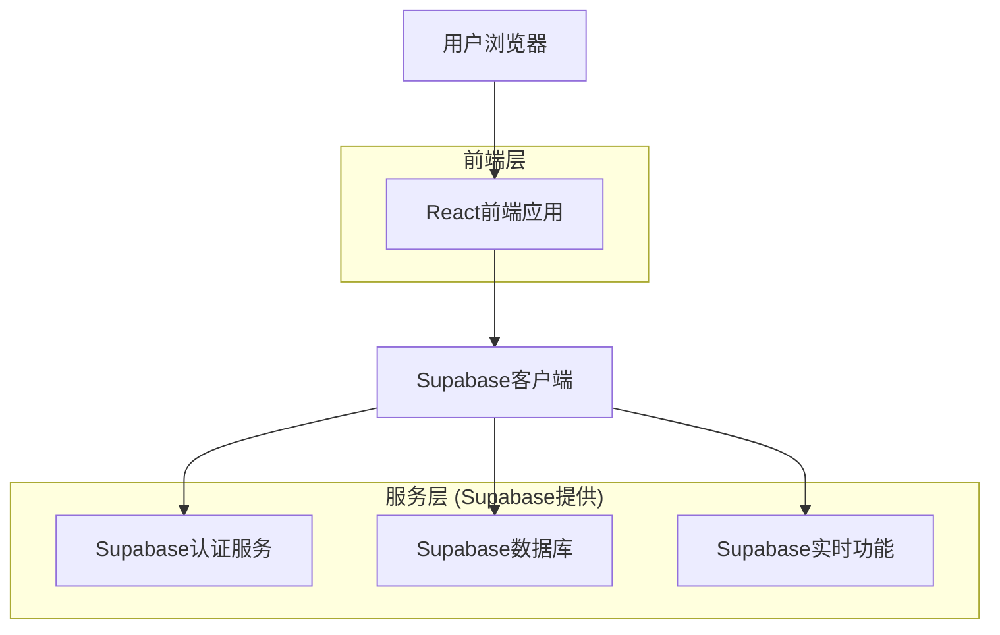
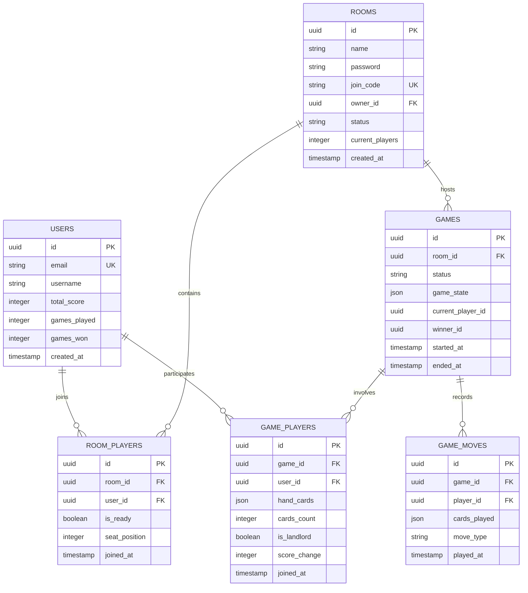

## 1. 架构设计



## 2. 技术描述

- **前端**: React@18 + TailwindCSS@3 + Vite
- **移动端适配**: 
  - 使用 viewport meta 标签控制缩放: `width=device-width, initial-scale=1, maximum-scale=1, user-scalable=no`
  - 使用 CSS Media Queries (@media) 处理不同断点
  - 触摸手势库: `use-gesture` (用于处理手牌滑动选择)
- **PWA支持**: 配置 `vite-plugin-pwa` 实现“添加到主屏幕”和离线缓存能力，提供类原生App体验
- **初始化工具**: vite-init
- **后端服务**: Supabase (认证 + PostgreSQL + 实时功能)
- **部署平台**: Vercel
- **状态管理**: React Context + useReducer
- **实时通信**: Supabase Realtime

## 3. 路由定义

| 路由 | 用途 |
|------|------|
| / | 登录/注册页面 |
| /lobby | 游戏大厅，显示房间列表 |
| /room/:roomId | 房间页面，玩家准备和等待 |
| /game/:gameId | 游戏页面，进行扑克对战 |
| /profile | 个人资料页面，查看积分和历史 |

## 4. API定义

### 4.1 房间管理API

**创建房间**
```
POST /api/rooms
```

请求参数：
| 参数名 | 类型 | 必需 | 描述 |
|--------|------|------|------|
| name | string | 是 | 房间名称 |
| password | string | 否 | 房间密码 |
| max_players | number | 是 | 最大玩家数（4）|

响应：
```json
{
  "room_id": "uuid",
  "join_code": "string"
}
```

**加入房间**
```
POST /api/rooms/:roomId/join
```

请求参数：
| 参数名 | 类型 | 必需 | 描述 |
|--------|------|------|------|
| password | string | 否 | 房间密码 |

### 4.2 游戏状态API

**开始游戏**
```
POST /api/games/:gameId/start
```

**出牌操作**
```
POST /api/games/:gameId/play
```

请求参数：
| 参数名 | 类型 | 必需 | 描述 |
|--------|------|------|------|
| cards | array | 是 | 出的牌数组 |
| card_type | string | 是 | 牌型（单张、对子等）|

## 5. 数据库架构

### 5.1 数据模型定义



### 5.2 数据定义语言

**用户表 (users)**
```sql
CREATE TABLE users (
  id UUID PRIMARY KEY DEFAULT gen_random_uuid(),
  email VARCHAR(255) UNIQUE NOT NULL,
  username VARCHAR(50) UNIQUE NOT NULL,
  password_hash VARCHAR(255) NOT NULL,
  total_score INTEGER DEFAULT 0,
  games_played INTEGER DEFAULT 0,
  games_won INTEGER DEFAULT 0,
  created_at TIMESTAMP WITH TIME ZONE DEFAULT NOW()
);

-- 索引
CREATE INDEX idx_users_email ON users(email);
CREATE INDEX idx_users_username ON users(username);
```

**房间表 (rooms)**
```sql
CREATE TABLE rooms (
  id UUID PRIMARY KEY DEFAULT gen_random_uuid(),
  name VARCHAR(100) NOT NULL,
  password VARCHAR(50),
  join_code VARCHAR(8) UNIQUE NOT NULL,
  owner_id UUID REFERENCES users(id),
  status VARCHAR(20) DEFAULT 'waiting' CHECK (status IN ('waiting', 'playing', 'finished')),
  current_players INTEGER DEFAULT 0,
  created_at TIMESTAMP WITH TIME ZONE DEFAULT NOW()
);

-- 索引
CREATE INDEX idx_rooms_join_code ON rooms(join_code);
CREATE INDEX idx_rooms_status ON rooms(status);
```

**游戏表 (games)**
```sql
CREATE TABLE games (
  id UUID PRIMARY KEY DEFAULT gen_random_uuid(),
  room_id UUID REFERENCES rooms(id),
  status VARCHAR(20) DEFAULT 'preparing' CHECK (status IN ('preparing', 'playing', 'finished')),
  game_state JSONB DEFAULT '{}',
  current_player_id UUID REFERENCES users(id),
  winner_id UUID REFERENCES users(id),
  started_at TIMESTAMP WITH TIME ZONE,
  ended_at TIMESTAMP WITH TIME ZONE,
  created_at TIMESTAMP WITH TIME ZONE DEFAULT NOW()
);

-- 索引
CREATE INDEX idx_games_room_id ON games(room_id);
CREATE INDEX idx_games_status ON games(status);
```

**游戏玩家表 (game_players)**
```sql
CREATE TABLE game_players (
  id UUID PRIMARY KEY DEFAULT gen_random_uuid(),
  game_id UUID REFERENCES games(id),
  user_id UUID REFERENCES users(id),
  hand_cards JSONB DEFAULT '[]',
  cards_count INTEGER DEFAULT 0,
  is_landlord BOOLEAN DEFAULT FALSE,
  is_invincible BOOLEAN DEFAULT FALSE,
  score_change INTEGER DEFAULT 0,
  joined_at TIMESTAMP WITH TIME ZONE DEFAULT NOW()
);

-- 索引
CREATE INDEX idx_game_players_game_id ON game_players(game_id);
CREATE INDEX idx_game_players_user_id ON game_players(user_id);
```

### 5.3 Supabase权限设置

```sql
-- 基本权限授予
GRANT SELECT ON users TO anon;
GRANT ALL PRIVILEGES ON users TO authenticated;

GRANT SELECT ON rooms TO anon;
GRANT ALL PRIVILEGES ON rooms TO authenticated;

GRANT SELECT ON room_players TO anon;
GRANT ALL PRIVILEGES ON room_players TO authenticated;

GRANT SELECT ON games TO anon;
GRANT ALL PRIVILEGES ON games TO authenticated;

GRANT SELECT ON game_players TO anon;
GRANT ALL PRIVILEGES ON game_players TO authenticated;

GRANT SELECT ON game_moves TO anon;
GRANT ALL PRIVILEGES ON game_moves TO authenticated;

-- RLS策略示例
ALTER TABLE rooms ENABLE ROW LEVEL SECURITY;
CREATE POLICY "Users can view all rooms" ON rooms FOR SELECT USING (true);
CREATE POLICY "Users can create rooms" ON rooms FOR INSERT WITH CHECK (auth.uid() = owner_id);

ALTER TABLE games ENABLE ROW LEVEL SECURITY;
CREATE POLICY "Users can view games they participate in" ON games FOR SELECT USING (
  auth.uid() IN (SELECT user_id FROM game_players WHERE game_id = games.id)
);
```

## 6. 实时功能设计

### 6.1 实时订阅
- **房间状态变化**: 玩家加入/离开、准备状态变化
- **游戏状态变化**: 出牌操作、轮次变化、游戏结束
- **聊天消息**: 房间内实时聊天

### 6.2 状态同步
使用Supabase Realtime确保所有玩家看到同步的游戏状态，包括：
- 当前出牌玩家
- 桌面上的牌
- 各玩家手牌数量
- 游戏阶段和状态